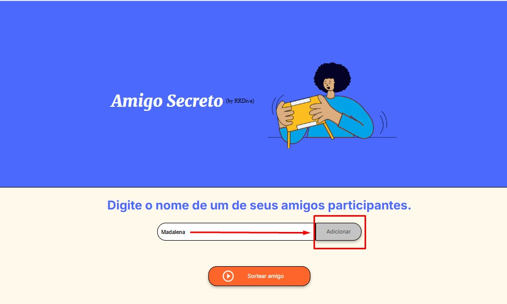
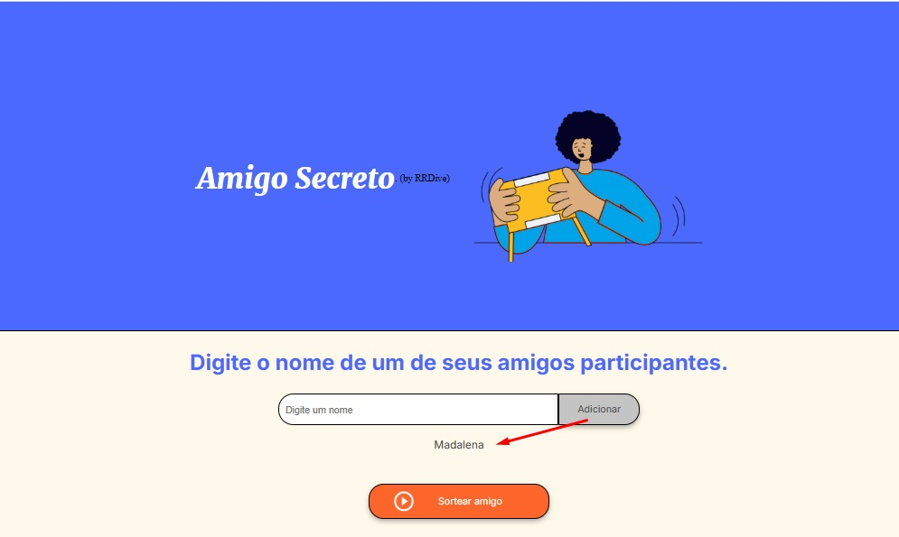

# Índice 

* [Apresentação](#Apresentação)
* [Descrição do Projeto](#Descrição)
* [Status do Projeto](#Status)
* [Funcionalidades e Demonstração da Aplicação](#Funcionalidades)
* [Cadastrando seus Amigos](#Cadastrando)
* [Desenvolvimento](#Desenvolvimento)
* [Tecnologias utilizadas](#Tecnologias)
* [Licença](#Licença)
* [Conclusão](#Conclusão)

# Apresentação

# Descrição

Projeto criado em Jan/2025, como fruto de aprendizado em programação JavaScript disponibilizado pelo Projeto ONE (Oracle + Alura).

Esta ferramenta demonstra lógica de programação com a utilização de função de números aleatórios, cadastramento de nomes em array e "sorteio" de um dos nomes cadastrados

O objetivo desta ferramenta consiste no "Sorteio Aleatório" de um dos nomes previamente cadastrados, elegendo-o como seu Amigo Secreto.

# Status

Este projeto encontra-se CONCLUÍDO, tomando como base as orientações fornecidas através dos cards via Trello e está disponível para uso no portal do VERCEL, através do link https://chalenge-amigo-secreto-git-main-sweesies-projects.vercel.app/

Contudo, algumas melhorias podem ser aplicadas, de maneira a gerar uma lista entre os amigos cadastrados (e não apenas 1 nome), permitindo assim que seja utilizada em vários eventos/momentos.

# Funcionalidades

Esta ferramenta possui uma única tela (ver acima), onde destacamos:

A: Campo para ser informado/digitado cada um dos nomes das pessoas indicadas.

B: Botão destinado à verificação e inserção do nome informado/digitado, na lista, caso o mesmo não tenha sido informado anteriormente.

C: Botão destinado à realização (de maneira aleatória) do "sorteio" do nome indicado para ser seu AMIGO SECRETO (se pressionado mais de uma vez, poderão ser observados resultados de maneira aleatória).

# Cadastrando

Utilizando o campo "A" indicado na tela anterior, digite/informe um nome e em seguida clique no botão [Adicionar].

O nome será listado logo abaixo do campo "A".

Após clicar no botão [Adicionar] o nome será apresetnado conforme exemplificado na tela abaixo e o campo estará disponível para o próximo nome.

# Desenvolvimento

Ferramenta desenvolvida por Filipe Macieira ([https://github.com/sweesie]).

# Tecnologias

No repositório serão encontrados arquivos correspondentes a HTML, CSS e JavaScript.

# Licença

# Conclusão

Jan/2025
 
